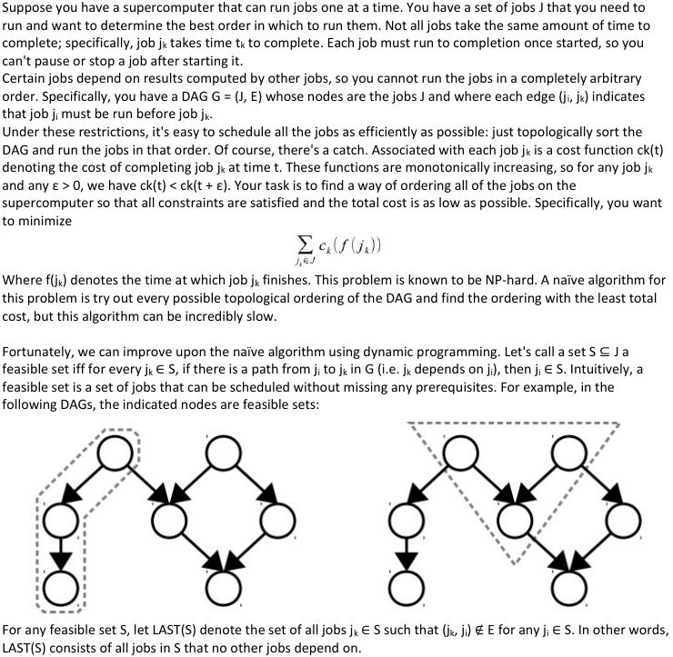

# Problem's description



# Input rules
Every line of input.txt contains a task with this format:

TaskName TaskPrerequisite TaskTime TaskCost

The program will read input.txt until reaching to an empty line or EOF.

There is an example test case in input.txt. You can read it to see how input.txt should be filled.

# Prerequisites
* Python2 *(python 2.7 is tested)*
* [asciitree python package](https://github.com/mbr/asciitree):
```
pip2 install asciitree
```
